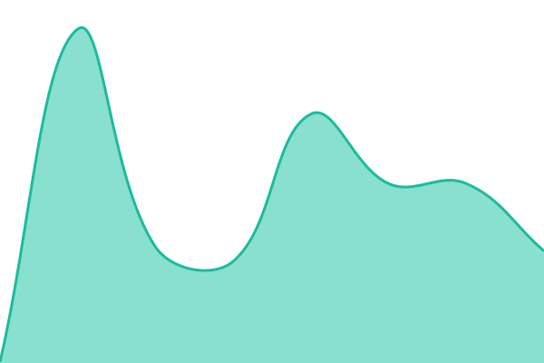
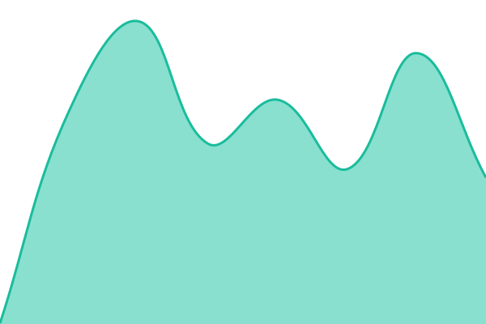
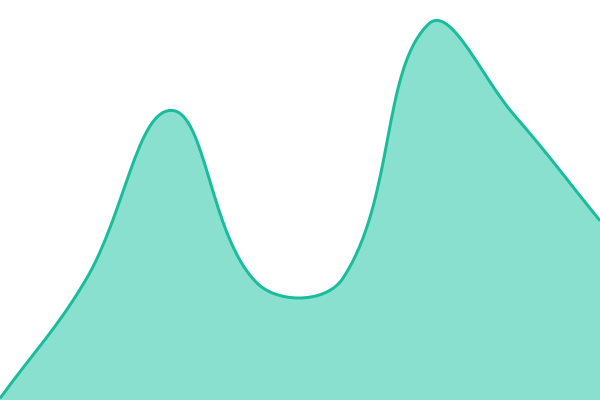

# [📈 Live Status](https://sgng.github.io): <!--live status--> **🟩 All systems operational**

This repository contains the open-source uptime monitor and status page for [sgng](https://sgng.github.io), powered by [Upptime](https://github.com/upptime/upptime).

With [Upptime](https://upptime.js.org), you can get your own unlimited and free uptime monitor and status page, powered entirely by a GitHub repository. We use [Issues](https://github.com/sgng/sgng.github.io/issues) as incident reports, [Actions](https://github.com/sgng/sgng.github.io/actions) as uptime monitors, and [Pages](https://sgng.github.io) for the status page.

<!--start: status pages-->
<!-- This summary is generated by Upptime (https://github.com/upptime/upptime) -->
<!-- Do not edit this manually, your changes will be overwritten -->
<!-- prettier-ignore -->
| URL | Status | History | Response Time | Uptime |
| --- | ------ | ------- | ------------- | ------ |
|  [Gitpod](https://gitpod.io) | 🟩 Up | [gitpod.yml](https://github.com/sgng/sgng.github.io/commits/HEAD/history/gitpod.yml) | 

 173ms
     
 | 

<a href="https://sgng.github.io/history/gitpod">100.00%</a>
    

|  [Logpaste](https://logpaste.com) | 🟩 Up | [logpaste.yml](https://github.com/sgng/sgng.github.io/commits/HEAD/history/logpaste.yml) | 

 167ms
     
 | 

<a href="https://sgng.github.io/history/logpaste">99.21%</a>
    

|  [Rentry](https://rentry.co) | 🟩 Up | [rentry.yml](https://github.com/sgng/sgng.github.io/commits/HEAD/history/rentry.yml) | 

 321ms
     
 | 

<a href="https://sgng.github.io/history/rentry">100.00%</a>
    

|  [Lets Markdown](https://letsmarkdown.com) | 🟩 Up | [lets-markdown.yml](https://github.com/sgng/sgng.github.io/commits/HEAD/history/lets-markdown.yml) | 

 17305ms
     
 | 

<a href="https://sgng.github.io/history/lets-markdown">94.27%</a>
    

|  [Shields.io](https://shields.io) | 🟩 Up | [shields-io.yml](https://github.com/sgng/sgng.github.io/commits/HEAD/history/shields-io.yml) | 

 126ms
     
 | 

<a href="https://sgng.github.io/history/shields-io">100.00%</a>
    

<!--end: status pages-->

[**Visit our status website →**](https://sgng.github.io)

## 📄 License

- Powered by: [Upptime](https://github.com/upptime/upptime)
- Code: [MIT](./LICENSE) © [sgng](https://sgng.github.io)
- Data in the `./history` directory: [Open Database License](https://opendatacommons.org/licenses/odbl/1-0/)
